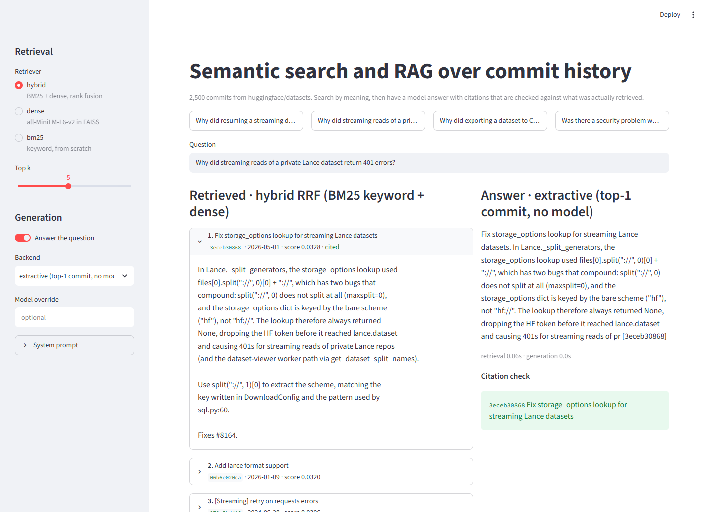

# Semantic search and RAG over commit history

Search a git repository's commit messages by meaning instead of exact words, feed the results to a language model that answers questions with citations, and measure both halves separately.

The corpus is 2,500 unique commit messages from [huggingface/datasets](https://github.com/huggingface/datasets). Two evaluations, with different conclusions:

1. **Self-retrieval (2,500 docs, 200 queries):** a commit's title has to find its own body. Keyword search (BM25) wins. This task is extractive by construction, so that is expected once you look at the data.
2. **Question answering (22 hand-written questions):** paraphrased questions a developer might actually ask. Dense retrieval finds the right commit at rank 1 more often than BM25 (20/22 vs 17/22). A 0.5B-parameter local model then answers from the retrieved commits, and its citation behaviour is measured against a no-model extractive baseline, which it does not beat.

## Demo

```
streamlit run app.py
```



Pick a retriever, ask a question, and optionally turn on generation. Every id the model cites is checked against the retrieved set and shown green (retrieved) or red (fabricated). `?q=<question>&answer=1` in the URL pre-fills the page.

## What it looks like on the command line

Question q04 from the question set, where the two retrievers disagree. The answering commit is `0f207a0a60`. BM25 ranks it fifth; dense retrieval ranks it first.

```
$ python search.py "Why did resuming a streaming dataset after a filter call skip rows that had not been emitted yet?" --method bm25
Method: BM25 keyword
1. [16.4102] Shard the sources when skipping a distributed IterableDataset  (60787dd3fd, 2026-09-10)
2. [16.3944] fix(iterable_dataset): preserve features when chaining filter() on typed IterableDataset  (07515575dd, 2026-03-10)
3. [15.5761] Reject a non-callable generator in GeneratorConfig  (4e56ddf20a, 2026-09-10)
4. [15.0428] Add note about the name of a dataset script  (656f8b2413, 2022-11-04)
5. [14.3690] Rebatch arrow source before formatting in IterableDataset.filter to fix resume data loss  (0f207a0a60, 2026-07-24)

$ python search.py "Why did resuming a streaming dataset after a filter call skip rows that had not been emitted yet?" --method dense
Method: dense (all-MiniLM-L6-v2)
1. [0.5219] Rebatch arrow source before formatting in IterableDataset.filter to fix resume data loss  (0f207a0a60, 2026-07-24)
2. [0.4803] Avoid content-encoding issue while streaming datasets  (805ff93095, 2021-12-01)
3. [0.4774] Fix filter with empty indices  (62fee304b9, 2022-10-07)
4. [0.4446] Support streaming swda dataset  (f10d38b8b6, 2022-08-30)
5. [0.4329] Fix streaming datasets that are not reset correctly  (5dbf75fdfa, 2022-01-28)
```

The same pipeline with generation and the citation check, using the extractive backend (no model):

```
$ python rag.py "Why did streaming reads of a private Lance dataset return 401 errors?" --retriever dense --backend extractive
Retriever: dense (all-MiniLM-L6-v2)
Generator: extractive (top-1 commit, no model)
Retrieved:
  3eceb30868  Fix storage_options lookup for streaming Lance datasets
  06b6e020ca  Add lance format support
  b4080cd057  Extend support for streaming datasets that use pd.read_excel
  be7689fb17  Support streaming hendrycks_test dataset.
  37361fe06e  Support streaming compguesswhat dataset
Answer:
Fix storage_options lookup for streaming Lance datasets. In Lance._split_generators, the storage_options lookup used
files[0].split("://", 0)[0] + "://", which has two bugs that
compound: split("://", 0) does not split at all (maxsplit=0),
and the storage_options dict is keyed by the bare scheme
("hf"), not "hf://". The lookup therefore always returned
None, dropping the HF token before it reached lance.dataset
and causing 401s for streaming reads of pr [3eceb30868]
Cited: ['3eceb30868']
retrieval 0.02s, generation 0.0s
```

Swap `--backend extractive` for `--backend local` to have Qwen2.5-0.5B write the answer instead (about 20 s on CPU), or `--backend claude` with an API key.

## Part 1: retrieval

Four retrieval methods are compared on the same label-free task:

| method | what it is |
|---|---|
| BM25 | classic keyword search, written from scratch in `keyword_baseline.py` |
| LSA | TF-IDF + truncated SVD, the pre-transformer "semantic" method |
| dense | sentence-transformer embeddings in a FAISS index (three models tried) |
| hybrid | BM25 + dense, merged with reciprocal rank fusion |

### Results

Task: for 200 randomly sampled commits, use the commit's one-line **title** as the query and check whether the search returns that commit's **body** from an index of all 2,500 bodies. Recall@k is the share of queries where the right body is in the top k; MRR is the mean of 1/rank.

Queries are also split into two halves of 100: titles whose every word (3+ characters) appears in the body, and titles where at least one word does not. The second half is where a method has to match meaning and not only tokens.

| method | R@5 | R@10 | MRR | MRR, partial overlap | MRR, full overlap |
|---|---|---|---|---|---|
| BM25 keyword | **0.835** | 0.860 | **0.727** | **0.531** | **0.920** |
| LSA (200d) | 0.505 | 0.585 | 0.361 | 0.262 | 0.459 |
| dense, all-MiniLM-L6-v2 (22M) | 0.725 | 0.810 | 0.603 | 0.411 | 0.791 |
| dense, bge-small-en-v1.5 (33M) | 0.725 | 0.785 | 0.654 | 0.433 | 0.870 |
| dense, all-mpnet-base-v2 (110M) | 0.725 | 0.780 | 0.582 | 0.397 | 0.763 |
| hybrid, BM25 + MiniLM | 0.830 | **0.865** | 0.720 | **0.531** | 0.906 |
| hybrid, BM25 + bge-small | 0.775 | 0.845 | 0.700 | 0.495 | 0.901 |
| hybrid, BM25 + mpnet | 0.795 | 0.855 | 0.703 | 0.522 | 0.881 |

Raw output, including per-query latency, is in `results/`, one file per dense model. The random seed is fixed (0), so the sample is reproducible.

#### What the numbers say

**Keyword search wins this task, and that is a property of the task.** A commit's title and body are written by the same person about the same change, minutes apart. Half the sampled titles have every word present in the body, and the median overlap is 1.0. Titles reuse exact identifiers (`CastError`, `data_dir`, `push_to_hub`) that BM25 matches literally and that a general-purpose embedding model treats as low-information tokens. This is close to the best case for lexical search. Queries that paraphrase and use different vocabulary should look different, and Part 2 below checks that with a small hand-written question set.

**Dense retrieval alone is clearly behind, even on the partial-overlap half.** The best dense model (bge-small) reaches 0.654 MRR against BM25's 0.727, and 0.433 against 0.531 on the harder half. So the embedding models are not rescuing the queries where keywords fail; they are losing on those too.

**Bigger is not better.** bge-small (33M parameters) is the best dense model, and all-mpnet-base-v2 (110M) lands below MiniLM (22M) while being four to five times slower per query. Training data and objective decided this, not size. None of the three was trained on code or commit text.

**Hybrid matches BM25 but does not beat it.** Rank fusion with MiniLM ties BM25 on the partial-overlap half and edges it on Recall@10, at two to three times the latency. If the goal were to ship one method for this corpus, plain BM25 would be the defensible pick; the hybrid is what I would choose if the query distribution were less extractive than this benchmark.

**LSA is the floor.** Cheapest method by far (about 4 ms/query, no model download), and it shows how much sentence transformers improved on the previous generation of "semantic" search.

### Caveats

- The evaluation is a proxy. Recovering a body from its own title is not the same as answering real user queries, and it favors exact-match methods by construction. There are no human relevance judgments.
- One random sample of 200 queries. Differences of a point or two are within noise; the BM25 vs dense gap is not.
- 2,500 documents is small. Latencies are for an exact (brute-force) FAISS index on CPU and say nothing about scaling.

## Part 2: question answering with citations

`rag.py` takes a question, retrieves the top-5 commits with one of the retrievers above, and asks a language model to answer using only those commits, citing commit ids in square brackets. Every id in the answer is then checked against the retrieved set. An id that was never retrieved is a fabrication by construction; the model had no way to see it.

### The question set

`data/questions.jsonl` has 22 questions I wrote by reading commit bodies, each tagged with the commit that answers it. They are paraphrased ("Why did streaming reads of a private Lance dataset return 401 errors?") rather than copies of the commit title, which makes this a closer stand-in for real queries than Part 1. It is still small, and I wrote both the questions and the labels, so treat the margins as indicative.

### Retrieval on the question set

| retriever | expected commit in top 5 | at rank 1 | MRR |
|---|---|---|---|
| BM25 | 22/22 | 17/22 | 0.873 |
| dense (MiniLM) | 22/22 | **20/22** | **0.943** |
| hybrid | 22/22 | 19/22 | 0.932 |

Every retriever gets the right commit into the context window every time, so retrieval is not the bottleneck for what follows. At rank 1 the order flips relative to Part 1: dense retrieval leads. That is consistent with the explanation given above, since these questions do not reuse the exact identifiers the way commit titles do.

### Generation

Three backends share the same prompt and the same citation checker:

| backend | what it is |
|---|---|
| extractive | no model. Returns the top-1 commit's title and body with its id. The floor a generator has to beat. |
| local | Qwen2.5-0.5B-Instruct via `transformers` on CPU. No key, no cost, runs on an 8 GB machine. Used for the committed numbers. |
| claude | `claude-opus-5` through the Anthropic SDK. Wired up and documented; needs `ANTHROPIC_API_KEY`. Not used for committed numbers because they must be reproducible without a paid key. |

Results with the local model (k = 5, greedy decoding, `results/rag_*.json`):

| generator | retriever | cites expected commit | cites anything | citation precision | wrongly abstains | s/answer |
|---|---|---|---|---|---|---|
| extractive | BM25 | 0.77 | 1.00 | 1.00 | 0.00 | 0.0 |
| extractive | dense | **0.91** | 1.00 | 1.00 | 0.00 | 0.0 |
| extractive | hybrid | 0.86 | 1.00 | 1.00 | 0.00 | 0.0 |
| Qwen2.5-0.5B | BM25 | 0.05 | 0.09 | 0.25 | 0.14 | 20.2 |
| Qwen2.5-0.5B | dense | 0.14 | 0.14 | 0.83 | 0.14 | 17.9 |
| Qwen2.5-0.5B | hybrid | 0.09 | 0.09 | 0.75 | 0.14 | 20.5 |

"Citation precision" is the share of cited ids that were actually in the retrieved context; "wrongly abstains" is how often the model said the commits do not cover the question when the answering commit was in its context (it always was).

#### What the numbers say

**The 0.5B model does not beat "print the top search result".** It cites the right commit in at most 14% of answers, abstains on 14% of questions it had the answer to, and in a few cases copies the illustrative id from the prompt's format example (the checker flags every one of those as fabricated, which is the point of having a checker). Reading the answers by hand: many are correct paraphrases of the right commit with the citation simply missing, but one (q05) inverted the two schema types it was describing, which is the kind of subtle error a citation would at least let a reader check.

**This is a model-size result, not a pipeline result.** Retrieval delivered the right commit 100% of the time. The failure is in instruction following by a model small enough to run on a 2012 CPU with 8 GB of RAM. The code takes `--model` for a larger local model and `--backend claude` for the API; I have not run either, so the README makes no claim about them.

**Measuring the halves separately is what makes the table readable.** Had I reported only "answer quality", retrieval and generation failures would be indistinguishable. Splitting them shows the retriever is done and the generator is where the next hour of work should go.

## Data cleaning

Three things in the raw `git log` output distorted the evaluation for every method and were removed in `fetch_data.py`:

- the `(#1234)` PR-number suffix GitHub appends to squash-merged titles (present on about 84% of commits, never in the body, never something a person would search for). Cherry-picks onto release branches carry two of them, `Title (#8241) (#8300)`; the first version of the regex only stripped one, and a dataset test caught the 12 survivors;
- git trailer lines (`Co-authored-by:`, `Signed-off-by:`) in bodies, which left some bodies with no actual content;
- duplicate commits: `git log --all` walks every branch, so cherry-picks and release-branch commits appeared under several hashes. Before deduplication 12% of the corpus was a repeat of another document, and the "correct" body could lose rank 1 to its own twin.

Commits whose cleaned body is shorter than 5 words are excluded from the query sample (they remain in the index). That leaves 1,465 eligible commits, from which the 200 are drawn.

## Running it

```
python -m venv venv
venv\Scripts\activate            # Windows;  source venv/bin/activate on macOS/Linux
pip install -r requirements.txt

python search.py "handle missing files when loading a dataset"          # dense (MiniLM)
python search.py "handle missing files when loading a dataset" --method bm25
python search.py "handle missing files when loading a dataset" --method hybrid --k 10

python evaluate.py                                                       # BM25, LSA, MiniLM, hybrid
python evaluate.py --model BAAI/bge-small-en-v1.5
python evaluate.py --skip-dense                                          # BM25 + LSA only, no torch

python rag.py "why did to_csv turn integer columns into floats"          # local model, hybrid retriever
python rag.py "..." --retriever dense --backend extractive
python rag.py "..." --backend claude                                     # needs ANTHROPIC_API_KEY, pip install anthropic

python evaluate_rag.py --backend extractive                              # seconds
python evaluate_rag.py                                                   # local model, ~30 min on CPU
```

```
python -m pytest                                                         # 40 tests, a few seconds, no model download
streamlit run app.py                                                     # browser demo
```

The tests cover the BM25 scoring formula, reciprocal rank fusion, LSA, the data cleaning rules, the evaluation metrics, the citation checker, and the integrity of the committed dataset (size, uniqueness, cleaning, every question points at a real commit). They run without torch so they are fast enough to run on every change.

`data/commits.jsonl` is committed, so nothing needs to be cloned to run the above. To rebuild it from a fresh metadata-only clone of the source repo:

```
python fetch_data.py
```

## Layout

```
fetch_data.py        clone huggingface/datasets (metadata only), extract, clean, dedupe
keyword_baseline.py  BM25 from scratch
embedder.py          DenseIndex (sentence-transformers + FAISS) and LSAIndex (scikit-learn)
hybrid.py            reciprocal rank fusion of any two searchers
search.py            command-line search
evaluate.py          self-retrieval evaluation with overlap split; writes results/<model>.json
rag.py               retrieve -> generate -> check citations; extractive / local / claude backends
evaluate_rag.py      runs the question set through every retriever; writes results/rag_<backend>.json
app.py               Streamlit demo: retriever picker, ranked commits, answer with citation check
tests/               pytest suite; runs without torch
data/commits.jsonl   2,500 cleaned commit records: id, title, body, text, author, date
data/questions.jsonl 22 hand-written questions with the commit that answers each
results/*.json       raw evaluation output, retrieval and RAG
assets/demo.png      screenshot of the demo
```
